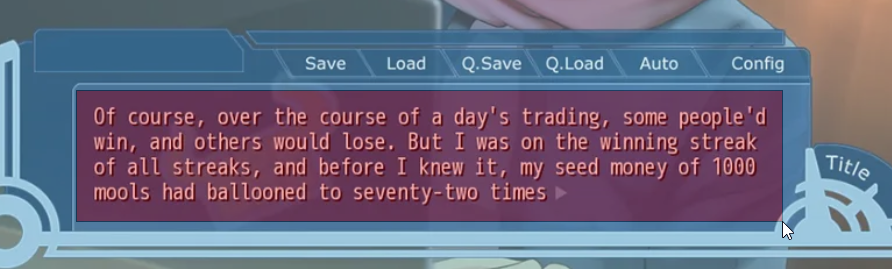
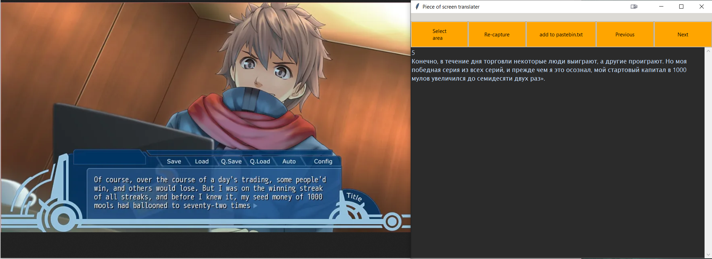

Piece-of-screen-translator

Переводит выбранную часть экрана.

Требования:
установленный tesseract OCR
модули Python, перечисленные в requirements.txt

Запуск:
python postr.py

Выбор области перевода:

Результат:
